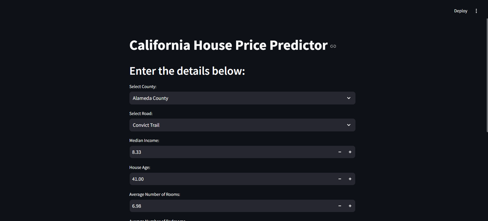
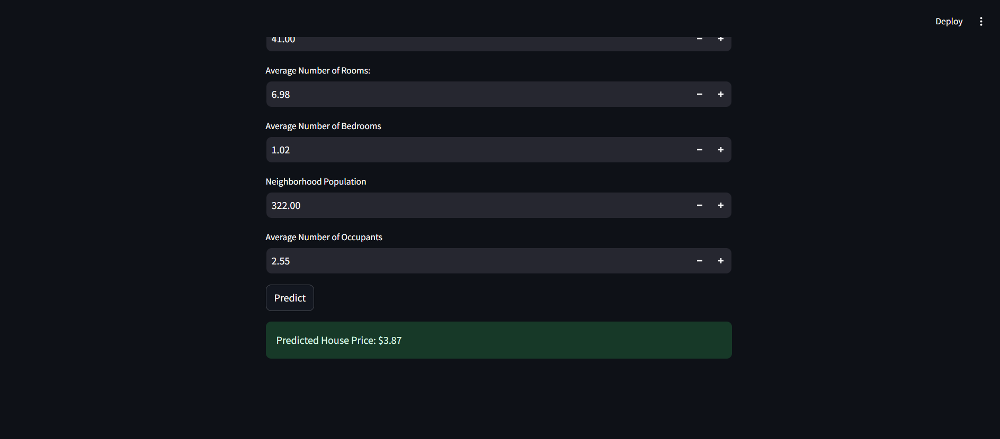

# House Price Prediction Project

## Overview
This project is a machine learning-based application to predict house prices. The model is built using Random Forest Regressor, incorporating feature engineering and data preprocessing. Additionally, a frontend interface has been developed using Streamlit to make the prediction process user-friendly for regular customers. The project is structured into different parts for data collection, analysis, and model building.

## Screenshots





## How to Run the Project
### Prerequisites
Ensure you have the following installed:

- Python 3.8+
- Virtual Environment (recommended)

1. Clone the repository:
```bash
git clone https://github.com/jerinpious/House-Price-Prediction
cd House-Price-Prediction
```
2. Create and activate a virtual environment:

```bash
python -m venv venv
source venv/bin/activate  # Linux/Mac
venv\Scripts\activate     # Windows
```

3. Install dependencies:

```bash
pip install -r requirements.txt
```

4. Preprocess the dataset(optional):

``` bash
python src/preprocess.py
```

5. Train the model(optional):
```bash
python src/main.py
```
6. Run the Streamlit app:

```bash
streamlit run app/app.py
```
## Project Structure
The project consists of the following files and directories:

- `data/`: Contains the pickle file with the latitude and longitude data along with the corresponding county and road information.
- `fetched_location_data.py`: A Python script that fetches the actual county and road information using latitude and longitude data from the dataset. It uses the Geopy library to retrieve the data and saves the results as a pickle file.
- `main.ipynb`: The main Jupyter notebook that loads and imports the data from the pickle file. 
Trains models: Random Forest Regressor using the processed dataset.
Evaluates model performance and exports the trained model as a .pkl file.
- `preprocess.py`: Handles data preprocessing tasks, including:
Encoding the County and Road features using LabelEncoder.
Saving the processed data for consistent feature mapping across predictions.
- `main.py`: A Streamlit-based web application that:
Provides an interactive interface for users to input feature values.
Maps user inputs to encoded values for County and Road.
Uses the trained model to predict house prices based on user inputs.


You can install the required dependencies using the following command:

```bash
pip install -r requirements.txt
```
## Workflow

### Data Loading:
The `fetched_location_data.py` script creates a pickle file with latitude and longitude coordinates along with corresponding county and road information fetched using Geopy.

### Exploratory Data Analysis (EDA) & Data Preprocessing:
The `preprocess.ipynb` file loads the pickle file and performs an initial analysis of the dataset using EDA techniques. This helps to understand the data distribution, feature correlation, and feature importance. The dataset undergoes feature engineering and cleaning. The latitude and longitude features are used to fetch missing data, specifically the `County` and `Road` features. Some irrelevant or non-correlated features are dropped to improve the model's performance.

### Modeling:
- **SGDClassifier** is used to predict missing values for the `Road` and `County` columns.
- **Random Forest Regressor** model are trained on the preprocessed data to predict house prices.

### Model Evaluation:
The performance of the trained models is evaluated using metrics such as R², RMSE, and MAE to determine the best model for price prediction.

## How to Run the Project
1. Clone or download the repository.
2. Install the required dependencies.
3. Run the `fetched_location_data.py` script to create the pickle file(suggest not doing it and using the pickle file already in data folder as it takes 5-7hrs).
4. Open and run the `main.ipynb` notebook to load the data, preprocess it, and train the models.

## Notes
- This is a temporary README to describe the project's current structure and steps.
- The project is still under development and might undergo changes, especially in terms of model performance and evaluation.
